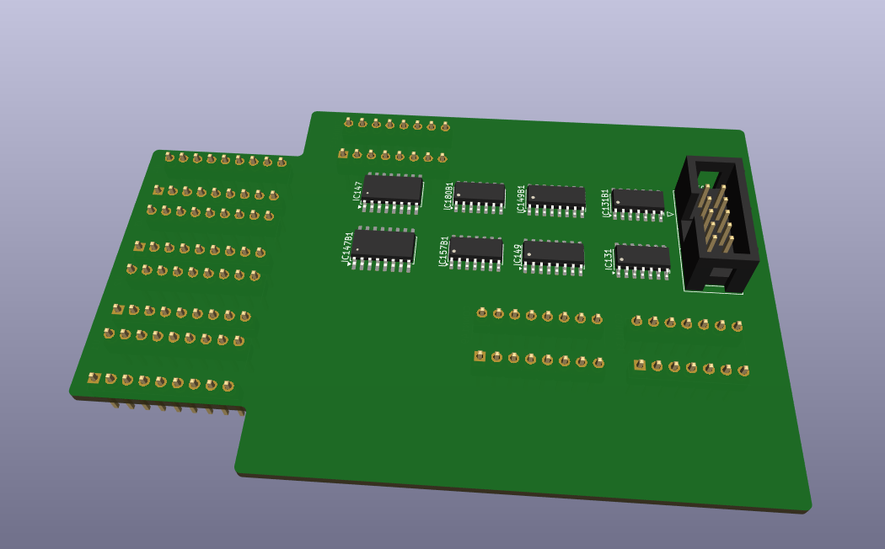

# nms8280_1mb_mapper

Project to document and create a 1MB module for a Philips NMS8280 MSX. Based on a paper by Hans Oranje.

This project is far from production ready. It is only a concept. I wouldn't even call it a proof of concept. 

## Reference documents

- [1MB PC SIMM by Hans Oranje](./1mbnms8280e.pdf)
- [Philips NMS 8280 Service Manual](./Philips%20NMS%208280%20Service%20Manual.pdf)

